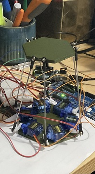

# stewart_platform

Using this project as a way of becoming familiar with zephyr and the nrf5340.

## goals

- use PWM signals and inverse kinimetics to make a stewart platform
- Create controller using joystick and buttons as a peripherial
- create a custom pcb with a nrf5340 chip to make the platform

## Production

### Tools

6 servo motors
nrf5340 dev-kit

### Setting up devices

| Signal | Channel | Label       | Pin |
| ------ | ------- | ----------- | --- |
| &pwm0  | 0       | pwm_alpha   | 1.4 |
| &pwm0  | 1       | pwm_beta    | 1.5 |
| &pwm1  | 0       | pwm_gamma   | 1.6 |
| &pwm1  | 1       | pwm_delta   | 1.7 |
| &pwm2  | 0       | pwm_epsilon | 1.8 |
| &pwm2  | 1       | pwm_zeta    | 1.9 |

NRF5340 has 4 pwm generators each with four channels I made a overlay file and mapped 6 signals to corrospond with six servos, by using 3 generators, with 2 channels each.

```c
{
  mypwms{
    compatible = "pwm-leds";
    pwm_alpha: pwm_alpha{
      status = "okay";
      wms = <&pwm0 0 PWM_MSEC(20) PWM_POLARITY_INVERTED>;
    };

    pwm_beta: pwm_beta{
      status = "okay";
      pwms = <&pwm0 1 PWM_MSEC(20) PWM_POLARITY_INVERTED>;
   };

    pwm_gamma: pwm_gamma{
      status = "okay";
      pwms = <&pwm1 0 PWM_MSEC(20) PWM_POLARITY_INVERTED>;
   };

    pwm_delta: pwm_delta{
      status = "okay";
    pwms = <&pwm1 1 PWM_MSEC(20) PWM_POLARITY_INVERTED>;
   };

    pwm_epsilon: pwm_epsilon{
      status = "okay";
    pwms = <&pwm2 0 PWM_MSEC(20) PWM_POLARITY_INVERTED>;
    };

    pwm_zeta: pwm_zeta{
      status = "okay";
    pwms = <&pwm2 1 PWM_MSEC(20) PWM_POLARITY_INVERTED>;
    };
  };
}
```

Then I outputted each PWM signal to pins 1.4 - 1.9

```c
&pwm0_default {
  group1 {
  psels = <NRF_PSEL(PWM_OUT0, 1, 4)>, <NRF_PSEL(PWM_OUT1, 1, 5)>;
  };
};

&pinctrl {
  pwm1_default: pwm1_default {
    group1 {
      psels = <NRF_PSEL(PWM_OUT0, 1, 6)>, <NRF_PSEL(PWM_OUT1, 1, 7)>;
    };
  };

  pwm2_default: pwm2_default {
    group1 {
      psels = <NRF_PSEL(PWM_OUT0, 1, 8)>, <NRF_PSEL(PWM_OUT1, 1, 9)>;
    };
  };
};

```

### Testing Servos


Once I had the device tree configured I went on to test each servo could run inpendantly.
The pulse width ran form 1000-2000, representing 0-90degrees.
First I organised each pwm signal into a array of servo data

```c
typedef struct {
  const struct pwm_dt_spec name;
  uint32_t pulse;
} servo;

servo servos[SERVO_NUM] = {{PWM_DT_SPEC_GET(DT_ALIAS(alpha)), MINPULSE},
                           {PWM_DT_SPEC_GET(DT_ALIAS(beta)), MINPULSE},
                           {PWM_DT_SPEC_GET(DT_ALIAS(gamma)), MINPULSE},
                           {PWM_DT_SPEC_GET(DT_ALIAS(delta)), MINPULSE},
                           {PWM_DT_SPEC_GET(DT_ALIAS(epsilon)), MINPULSE},
                           {PWM_DT_SPEC_GET(DT_ALIAS(zeta)), MINPULSE}};
```

then made a function that sets all servos to the angle. The idea being, once all calculations for the servos desired angles are done then set all the servos in one function, avoiding too much delay between servos

```c
void set_Servos(servo *servos) {
  printk("Setting Servos");
  for (int i = 0; i < SERVO_NUM; i++) {
    pwm_set(servos[i].name.dev, servos[i].name.channel, PWM_USEC(PERIOD),
            PWM_USEC(servos[i].pulse), 0);
  }
}
```

I made another function so that I could input degrees to move servos instead of pulse width

```c
uint32_t angle_to_pulse(uint8_t angle) {
  float angle_pct = ((float)angle / 90.0f);
  uint32_t pulse = MINPULSE + (angle_pct * (MAXPULSE - MINPULSE));
  return pulse;
}
```

Then in the main loop I put in two angles values for the servos to switch between

```c
    if (servos[3].pulse == angle_to_pulse(25))
      servos[3].pulse = angle_to_pulse(50);
    else
      servos[3].pulse = angle_to_pulse(25);
```

once all servo pulses have been store I set the servos and waited before repeating the loop

```c
set_Servos(servos);
k_sleep(K_SECONDS(SLEEP_TIME_S));
```

### Prototype


prototype with some hexagons and blue-tack 

after adjusting the fit I implemented uart to test the movement, this also allows the pulse of each servo to be adusted through events as opposed to a continousloop
```c
    if ((evt->data.rx.len) == 1) {
      switch (evt->data.rx.buf[evt->data.rx.offset]) {
      case 'w':
        for (int i = 0; i < 6; i++)
          servos[i].pulse = MIDPULSE;
        set_Servos(servos);
        break;
      case 's':
        for (int i = 0; i < 6; i += 2)
          servos[i].pulse = MINPULSE;
        for (int i = 1; i < 6; i += 2)
          servos[i].pulse = MAXPULSE;
        set_Servos(servos);
        break;
    }
```


